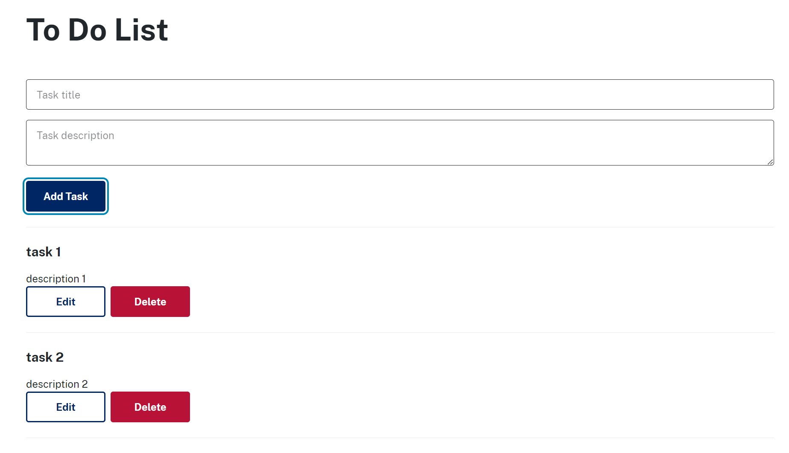

# Task List To-Do Application

## How to run backend API application?
1. Go to api folder
```
cd api
```
2. Install packages
```
npm install 
```
3. Run tests (Optional)
```
npm run test
```
4. Run application
```
npm run dev
```

## How to run front end React Application?
1. Go to frontend folder
```
cd frontend
```
2. Install packages
```
npm install
```
3. Run tests (Optional)
```
npm run test
```
4. Run application
```
npm run dev
```

Screenshot
